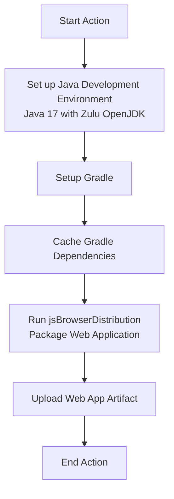

# KMP Build Web App GitHub Action

## Overview

This GitHub Action is designed to build a Kotlin Multiplatform (KMP) web application using Gradle. It automates the process of setting up the development environment, caching dependencies, and packaging the web application.

## Inputs

### `web_package_name`
**Required**: Yes
- Description: Name of the web project module
- Used to specify the correct path for building and uploading the web app artifact

### `java-version`
**Optional**: No
- Description: Java version to use (e.g., `17`, `21`).
- Defaults to `17` if not specified.

## Outputs

### `artifact-name`
- Description: Name of the generated artifact
- Value: `web-app`

## Action Workflow



The action performs the following steps:

1. **Set up Java Development Environment**
    - Uses Zulu distribution of OpenJDK
    - Configures Java version 17

2. **Setup Gradle**
    - Prepares Gradle for building the project

3. **Cache Management**
    - Caches Gradle dependencies, build outputs, and Kotlin/Native artifacts
    - Speeds up subsequent builds by reusing cached components
    - Caches include:
        - Gradle caches
        - Gradle wrapper
        - Kotlin/Native artifacts
        - Build directory

4. **Package Web Application**
    - Runs `./gradlew jsBrowserDistribution` to create the web app distribution

5. **Artifact Upload**
    - Uploads the web app artifact from the specified module's build directory

## Usage Example

```yaml
name: Build Web App

on: [push, pull_request]

jobs:
  build:
    runs-on: ubuntu-latest
    steps:
      - uses: actions/checkout@v4
      - uses: openMF/mifos-x-actionhub-build-web-app@v1.0.1
        with:
          web_package_name: 'web'
```

## Requirements

- GitHub Actions runner with bash support
- Gradle project configured for Kotlin Multiplatform
- Java (configurable; defaults to 17)
- Zulu OpenJDK distribution

## Best Practices

- Ensure your Gradle build scripts are configured for JS browser distribution
- Verify that the `web_package_name` matches your project's module structure
- Use consistent Gradle and Java versions across local and CI environments

## Troubleshooting

- Check Gradle logs if the build fails
- Verify that the `jsBrowserDistribution` task is correctly configured in your build script
- Ensure all necessary dependencies are declared in your Gradle files